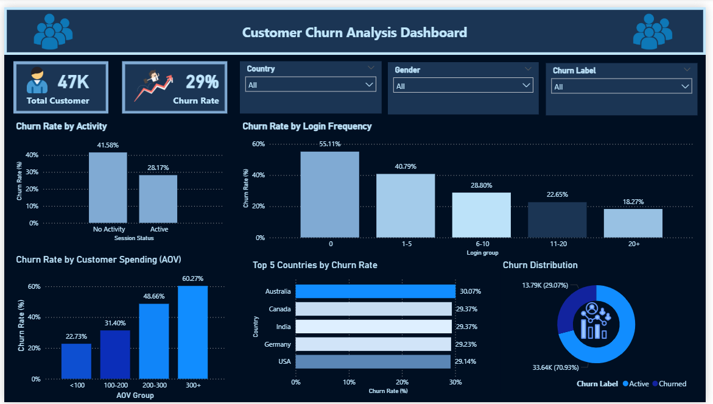

# 📊 Customer Churn Analysis

## 📌 Overview
This project analyzes customer churn behavior to identify key drivers of customer retention and provide actionable business insights.

## 🎯 Objective
- Identify factors influencing customer churn  
- Analyze user behavior patterns  
- Provide data-driven recommendations  

## 🛠 Tools Used
- SQL (PostgreSQL)
- Power BI
- Data Cleaning & Transformation

## 📂 Dataset
- ~47,000 customer records  
- Includes:
  - Demographics (age, gender, country)
  - User behavior (login frequency, session activity)
  - Purchase behavior (average order value)

## 🔄 Data Preparation
- Cleaned missing values  
- Standardized column names  
- Converted data types  
- Created new features:
  - Session Status
  - Login Group
  - AOV Group

## 📊 Key Insights

### 🔹 User Activity
Inactive users show significantly higher churn (~41%) compared to active users (~28%).

### 🔹 Login Frequency
Lower login frequency strongly correlates with higher churn. Users with zero login have the highest churn (~55%).

### 🔹 Customer Spending (AOV)
High-value customers (AOV 300+) show the highest churn (~60%), indicating potential dissatisfaction despite higher spending.

### 🔹 Geographic Analysis
Churn varies across countries, indicating regional behavioral differences.

## 📊 Dashboard

## 🚀 Business Recommendations
- Improve engagement strategies for inactive users  
- Encourage frequent platform usage  
- Focus retention efforts on high-value customers  
- Investigate high-churn regions for targeted strategies  

## 📁 Project Structure
- `/data` → Clean dataset  
- `/sql` → SQL queries for analysis  
- `/dashboard` → Power BI dashboard  

## 👩‍💻 Author
Siti Irma Dimayanti
